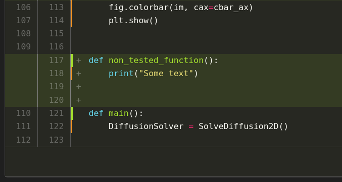

# Automating workflows with GitHub Actions and GitLab CI

In this exercise sheet you create automated workflows and pipelines based on GitHub Actions and GitLab CI. At the end of the exercise you find a section with hints and remarks.

Deadline: **Thursday, January 27th, 2022, 9:00**

## Task descriptions

The CI workflow consists of the three steps:

1. Check code style using `black` on the Python files in the repository.
2. Run tests while also collecting coverage information via `pytest` and the `coverage` package. The coverage information (stored in the file `.coverage`) has to be stored and handed over to the next step.
3. Create a coverage report (`coverage report`) in the terminal and afterwards also convert the coverage information into XML format (`coverage xml`). For this you have to reuse the coverage information (i.e. `.coverage`) from the previous step. The resulting file `coverage.xml` should be kept for 14 days.
    - Running `coverage report` allows us to inspect the coverage directly in the workflow's output. Saving the XML file allows us to analyze the coverage in more detail with other tools if needed.

Once the workflow runs successfully, add a badge for your pipeline/workflow to the `README.md`/repository.

## GitHub Actions

In this subtask you should implement the workflow as GitHub Action.

- Create a new repository named "sse-github-actions-exercise" in your own account/namespace on GitHub (with an empty README file) and clone the repository afterwards. Similar to the documentation exercise you have to work on the repository in your own GitHub namespace.

  **Note**: In this part of the exercise you **should not work with forks** because GitHub Actions may not work in pull requests without explicit approval of the owner of the target repository. It is also easier to add badges (see below) to the `README.md` if the repository is under your control.
- Add the contents of the [automation exercise repository (TODO: Update link)](https://github.com/Simulation-Software-Engineering/automation-exercise-preparation) to your own repository. You can do this by copying the files into your own repository, adding and committing them to Git. Afterwards push the changes to GitHub and verify that your repository contains the same files as the `automation-exercise` repository.

  **Note**: If you use another way of adding the data to your repository, e.g., by defining a new remote, make sure that the `origin` remote points to your own repository.

- Set up the GitHub Action to run the checks, tests, and to create the coverage report.
    - The action should have three jobs (`style_check`, `test`, `coverage_report`). Each of these jobs should carry out the corresponding step described in [Task descriptions](## Task descriptions).
    - The action should be triggered by `push` events.
    - The intermediate coverage information (`.coverage`) should be kept for one day. This is the minimum amount of time an artifact must be stored.
    - Make sure that in each job all of the needed Python dependencies are installed (for testing and for running the code) within the action. If you forgot, what the dependencies were, check out the [Python testing exercise sheet](https://github.com/Simulation-Software-Engineering/Lecture-Material/blob/main/05_testing_and_ci/python_testing_exercise.md).

- Add a [GitHub workflow status badge](https://docs.github.com/en/actions/monitoring-and-troubleshooting-workflows/adding-a-workflow-status-badge) to the README that is based on your workflow and the main branch.
    - Label this badge with "SSE CI/CD".

- Submit your solution via an issue. You cannot submit a pull request since you cannot use a fork in the exercise. You can also add the issue before you are done in order to ask questions. If you are opening an issue before you are finished, please add a comment in the issue mentioning that it is "work in progress". When you are finished, please add another comment that the issue (or rather your repository) is "ready for review".
    - Create an issue in the [automation exercise repository (TODO: Update link)](https://github.com/Simulation-Software-Engineering/automation-exercise-preparation).
    - The issue should be named `[USERNAME] GitHub Actions exercise`, e.g., `[jaustar] GitHub Actions exercise`. Please use the GitLab username here.
    - Please add a link to your GitHub repository.

## GitLab CI/CD

In this subtask you should implement the workflow using GitLab CI and add a GitLab Runner to your repository.

- Create a **fork** of the GitLab repository [automation exercise repository (TODO: Update link)](https://gitlab-sim.informatik.uni-stuttgart.de/sse-test-group/automation-exercise).
- Install GitLab Runner on your machine and register a runner for your repository/fork. The runner should support the `docker` executor and should be able to run Linux images since you should use a Linux Docker image in this exercise. Have a look at the [detailed installation instructions](https://docs.gitlab.com/runner/install/). It is usually easiest to install GitLab Runner as [Docker service](https://docs.gitlab.com/runner/install/docker.html) as shown in the exercise.

  If you cannot add such a runner on your machine, please sent an email with the registration token and your GitLab username to [alexander.jaust@ipvs.uni-stuttgart.de](mailto:alexander.jaust@ipvs.uni-stuttgart.de). We will then add a runner to your repository/fork.

- Set up the GitLab pipeline to run the checks, tests, and to create the coverage report.
    - The pipeline should have three jobs (`style_check`, `test`, `coverage_report`). Each of these jobs should carry out the corresponding step described in [Task descriptions](## Task descriptions).
    - The intermediate coverage information (`.coverage`) should be kept for [three hours](https://docs.gitlab.com/ee/ci/yaml/index.html#artifactsexpire_in).
    - Make sure that your runner is online while you make changes to the repository. Otherwise the CI/CD pipeline cannot run.
    - Use the Docker image [`ajaust/automation-exercise`](https://hub.docker.com/repository/docker/ajaust/automation-exercise) that is available from Docker Hub for this task. You can find its Dockerfile in the exercise's repository if you are interested what is installed in the image. The image is similar to the image used in the lecture, but is based on Ubuntu to make the exercise simpler.
    - If a pipeline does not finish, check the output of its jobs and cancel it manually if necessary.

- Add a [GitLab pipeline status badge](https://docs.gitlab.com/ee/user/project/badges.html) to the project that is based on your pipeline and the main branch. You do not have to add the badge to the `README.md` as it is added automatically to the repository.
    - Label this badge with "SSE CI/CD".
    - Follow the suggestions for "Link" and "Badge image URL", but replace the `https://gitlab.com` by `https://gitlab-sim.informatik.uni-stuttgart.de`.
- Submit your solution via a merge request. If you are opening the merge request before you are finished, please mark it as draft.
    - Create an issue in the [automation exercise repository (TODO: Update link)](https://gitlab-sim.informatik.uni-stuttgart.de/sse-test-group/automation-exercise).
    - The issue should be named `[USERNAME] GitLab CI/CD exercise`, e.g., `[jaustar] GitLab CI/CD exercise`. Please use the GitLab username here.

## Optional tasks

If you have worked on any of the optional tasks, please mention this in the corresponding issue and merge request.

### GitHub

- Extend your submission of [documentation tools exercise](https://github.com/Simulation-Software-Engineering/Lecture-Material/blob/main/04_documentation/tools_exercise.md). There are several ways one can extend the submission:
    - Add a [GitHub action](https://github.com/marketplace/actions/deploy-mkdocs) to automatically deploy your documentation every time a change is pushed to the `main` branch.
    - Add an action that checks the style of the markdown files.
    - Add an action that checks that all links of your homepage/markdown files are valid.

### GitLab

- Add coverage visualization to merge requests. You can add coverage report visualization via the [artifacts reports feature](https://docs.gitlab.com/ee/ci/yaml/index.html#artifactsreports). For the XML file generated by `coverage` this feature is [integrated in GitLab](https://docs.gitlab.com/ee/user/project/merge_requests/test_coverage_visualization.html#python-example).
    - To make this feature visible you have to create a new branch, change the file `diffusion2d.py` and create a merge request. Go to the merge request and inspect the changes of the Python file (see "Changes" tab). You should see orange and green highlighting next to the line numbers. Orange means that this line was not covered. Green means that the line was covered by the coverage report. For an example, see the screenshot below.

      

## Hints and remarks

- If you get unexpected error like

  ```text
  jobs style job config should implement a script: or a trigger: keyword
  ```

  when using GitLab CI/CD, check whether the indentation of the commands is correct. You can also use the YAML linter of GitLab CI/CD. You can find the linter in your fork in the menu on the left following CI/CD -> Editor -> Lint.