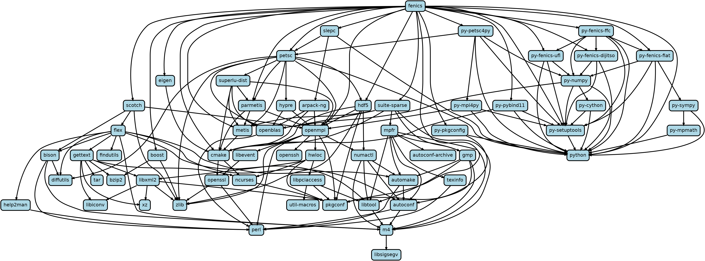

<style>
  .reveal strong {
    font-weight: bold;
    color: orange;
  }
  .reveal p {
    text-align: left;
  }
  .reveal section h1 {
    color: orange;
  }
  .reveal section h2 {
    color: orange;
  }
  .reveal code {
    font-family: 'Source Code Pro';
    color: orange;
  }
  .reveal section img {
    background:none;
    border:none;
    box-shadow:none;
  }
</style>

# Packaging for High-Performance Computing

---

## Learning goals

- What are the challenges when bringing (your) software to supercomputers?
- How to use Spack to install software.
- How to create a Spack package for your own software.

---

## Introduction

- Scientific software installation on supercomputers faces challenges:
    - Parallel architectures (MPI, OpenMP, HPX...)
    - Special hardware (accelerators, network...)
    - Greatly varying architectures (AMD, Intel, ARM...)
    - Missing dependencies (too new, too old...)
- Users and admins require fastest executable possible
    - Optimized compilation settings
    - Optimal settings depend on platform

---

## Package Managers for HPC

- Package manager are a topic of great interest:

    [European Environment for Scientific Software Installations (EESSI)](https://github.com/EESSI/)

- Popular package managers for HPC
    - [Spack](https://spack.io/)
        - Originates from LLNL in US
    - [EasyBuild](https://github.com/easybuilders/easybuild)
        - Originates from Ghent University in Belgium

---

## Spack


- HPC-friendly package manager
    - Common scientific software included
    - No superuser rights needed
    - [Dependencies](https://spack.readthedocs.io/en/latest/getting_started.html#system-prerequisites) commonly available on Supercomputers
        - Python, git, curl...
- [Open-source project on GitHub](https://github.com/spack/spack)

---

## Dependency Graph of FEniCS




**TODO** Fix URL uploaded

---

## Spack Installation

- Git repository of Python scripts

  ```bash
  git clone -b releases/v0.17 https://github.com/spack/spack.git
  ```

    - `v0.17` is currently the latest release

- Add Spack to `PATH`

  ```bash
  . ${SPACK_ROOT}/share/spack/setup-env.sh
  ```

    - Add this command to `.bashrc` to make permanent
    - `SPACK_ROOT` points to local Spack directory

---

## Spack Configuration and Caches

- Spack heavily relies on `yaml` files
    - Take care of space if you edit these files
- User configuration in `${HOME}/.spack`
- Several [other configuration scopes](https://spack.readthedocs.io/en/latest/configuration.html)

---

## Spack Demo

- Set up Spack
- Create package for our [CPack example](https://github.com/Simulation-Software-Engineering/HelloWorld)
    1. Create boilerplate package
    2. Add package details
    3. Verify package
    4. Model dependencies and add variants

---

## Advanced Features

- Reproducible [builds](https://spack-tutorial.readthedocs.io/en/latest/tutorial_environments.html#building-in-environments) and [environments](https://spack-tutorial.readthedocs.io/en/latest/tutorial_environments.html)
- Own [mirrors and caches](https://spack-tutorial.readthedocs.io/en/latest/tutorial_binary_cache.html)
- [Container images](https://spack.readthedocs.io/en/latest/containers.html)
- [Chained installation](https://spack.readthedocs.io/en/latest/chain.html)
- [Stacks (build matrices)](https://spack-tutorial.readthedocs.io/en/latest/tutorial_stacks.html)
- [Software management (modules)](https://spack.readthedocs.io/en/latest/module_file_support.html)
- ...

---

## Further Reading

- [EasyBuild](https://github.com/easybuilders/easybuild)
- [EasyConfigs](https://github.com/easybuilders/easybuild-easyconfigs)
- [Spack](https://spack.io/)
- [Spack docs](https://spack.readthedocs.io/en/latest/)
- [Spack 101 tutorials](https://spack-tutorial.readthedocs.io/en/latest/)
- [archspec project](https://github.com/archspec/)

---

## Presentations

- [Spack's new Concretizer](https://archive.fosdem.org/2020/schedule/event/dependency_solving_not_just_sat/)
- [Build for your microarchitecture: experiences with Spack and archspec](https://archive.fosdem.org/2020/schedule/event/archspec/)
- [Binary packaging for HPC with Spack](https://archive.fosdem.org/2018/schedule/event/llnl_spack/)
- ["How To Make Package Managers Cry"](https://archive.fosdem.org/2018/schedule/event/how_to_make_package_managers_cry/)