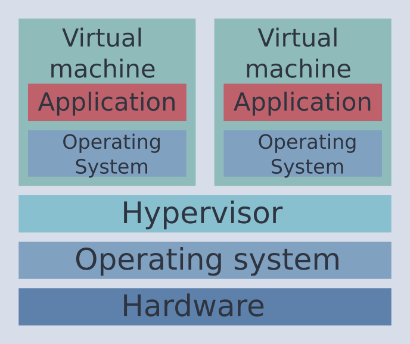

# Virtualization and containers

*Learning goals*

- What is the difference between virtualization and containers?
- When to use virtual machines and when containers.
- How to work with virtual machines (VirtualBox) and how to manage these with Vagrant.
- Building containers with Docker and Singularity.
- Understand pros and cons of different container technologies.
- Student can set up their own containers tailored to their requirements.

## Quiz (optional)

- Who is using containers or virtualization technologies?!
- Which tools do you use/know?

## Introduction to virtualization and containerization

| Duration | Format |
| --- | --- |
| 15 minutes | Slides |




- What is virtualization and what is containerization?
    - What problems do they solve? Why do we need them?
- What are the differences between VMs and containers?
    - Virtual machines (VWs)
        - Emulating a complete computer.
        - Has a (type 1/2) hypervisor. Type 1 runs on bare metal while type 2 runs within an operating system. Distinction not always clear.
        - Might need/benefit from virtualization technologies (VT-X)
        - Great flexibility. Can run (normally) any operating system that runs on the virtualized platform.
        - Strict separation from host operating system. (Popular for safety critical tasks: c't banking os, Desinfec't, Remote laptops)
    - Containers
        - Low(er) overhead than virtual machines.
        - Container operates in "fenced off" part of the operating system (`cgroups`).
        - Container runs kernel of the host OS.
        - Operating system (OS) needs to be compatible with underlying OS. Cannot run different OS than host. (TODO: Verify this)
            - **Note**: Windows 10 can run Linux containers! (Due to Windows Subsystem for Linux?!)
- Focus will be on Linux and Linux-based containers and VMs.
- Various virtualization and container technologies and tools to manage them. Sometimes separation is a bit vague/complicated and changed over time (lxc/lxd, Docker).
- We discuss tools that are (more) likely to be encountered in simulation software.

## Introduction to VirtualBox

| Duration | Format |
| --- | --- |
| 15 minutes | Slides |

- Big variety of solutions Kernel-based Virtual Machine (KVM)
- Short background story
    - Created by Innotek (Weinstadt, Germany! That is close to Stuttgart) and obtained by Sun Microsystems in 2008. Since 2010, owned by Oracle.
- Initially closed source product with special license for personal use and evaluation (PUEL). Now: Open Source edition which is free, open-source virtual machine solution (GPL2).
- Discuss some additional foundations of virtualization technologies.
- Virtual machines are based on virtual disks (VDI) which are virtual hard drives. Might be static or dynamic in size. Makes it possible to move virtual machines easily around.
- You can have root rights inside your virtual machine.
- VM will obtain exclusive access to some of your
- What problems does it solve?
    - You want to run a different operating system within your current one. Example: I am on Linux, but want to use Microsoft Office and other stuff (without using WINE/Proton).
    - You want to run services in an encapsulated way. Want to run than one server on one physical machine. (Proxmox, KVM)
- Short question: What type of hypervisor is VirtualBox? Type 2


## VirtualBox demo

| Duration | Format |
| --- | --- |
| 15 minutes | Demo |

- Discuss configuration:
    - Virtual machine will reserve cores/threads of your CPU and main memory.
- Maybe go through installation process to show that it is the same as installing an OS on your normal computer.
- Boot up some virtual machine.
- Show/install extensions to allow for
    - Some 3D rendering
    - Shared clipboard
    - In general: *Better integration* into host system
- Create a shared drive to exchange data instead of copy and pasting file content.

## Vagrant

| Duration | Format |
| --- | --- |
| 15 minutes | Slides |

- Short background
    - Company: HashiCorp
    - Founder (Hashimoto) has background in DevOps
    - HashiCorp also develops other container/virtualization management tools like TerraForm
- Configure VMs (I think also containers nowadays) conveniently via text files
- Infrastructure as code (Git lecture: If you cannot use `diff`, it is the wrong format!)

## Vagrant practical example

| Duration | Format |
| --- | --- |
| 15 minutes | Demo |

- Fire up and use VirtualBox VM.
    - Example could be the preCICE Vagrant VM.
## Recap containers and overview

| Duration | Format |
| --- | --- |
| 10 minutes | Slides |

- Shortly recap what we have learned about containers.
    - Fenced-off, relies on capabilities of OS etc.
- LXD/LXC and its container registry [Linux containers](https://linuxcontainers.org/)
- Short and incomplete overview over container technologies: Docker, Singularity, lxc/lxd, podman...

**Note**: Students not running Linux or without sufficient rights on their machine should be able to use a virtual machine to run Docker/Singularity on their machine if they could get that installed.
## Docker

| Duration | Format |
| --- | --- |
| 15 minutes | Slides |

- The most popular container framework one finds at the moment
- Short backstory:
    - Started as wrapper around lxc/lxd (Linux' native container format)
- Quite strong encapsulation from Host (**TODO**: Check for file exchange, networking etc.)
- Common commands:
    - TODO
- Explain text-based format (infrastructure as code)
  ```Dockerfile
  # Example taken from https://github.com/carlossg/docker-maven
  FROM openjdk:7-jdk-alpine

  RUN apk add --no-cache curl tar bash
  ```
- One can pre-build own images to reuse them later.
- Has a layer based build process (which is nice).
- Images can be shared via DockerHub
- Building an image can be pain in the neck as it depends on a fast internet connection.
- Installation issue/security risks: Docker user group is basically root
    - Rootless installation of Docker

## Docker practical example

| Duration | Format |
| --- | --- |
| 15 minutes | Demo |

- Write some Dockerfile, build container and run it.
    - Cowsay example? That could be easily reused on the Singularity example.

## Singularity

| Duration | Format |
| --- | --- |
| 15 minutes | Slides |

- Back story
    - Created at Lawrence Berkeley National Laboratory but now developed by SyLabs
    - Based on Go
- Container solution with high-performance computing in mind
    - "Mobility of compute", "Bring your own environment"
        - Mobility of your compute environment
        - Normally immutable images
    - Integration in scheduling systems
    - Runs in *user-space* (no root privilege escalation)
    - Direct network and (some) hardware access (GPUs, accelerators)
    - Mounts common/important directories
    - Images can be based on Docker images (**TODO** check this). This is nice to prebuild parts of the image as Docker image since Singularity's format is not layer based. This means you have to rebuilt from scratch if it fails.
    - Small runtime penalty.
- Nowadays available on many HPC platforms
- Show text-based file format. Is similar to Docker
- Common commands:
    - TODO
## Singularity practical example

| Duration | Format |
| --- | --- |
| 15 minutes | Demo |

- Write some Singularity recipe, build container and run it.
    - Same example as for Docker?
- Show the mounted filesystems and hardware access.
- Show that we cannot run things as root.
- (Optional if enoug time): Show Docker and Singulity container side by side

## Concluding remarks

| Duration | Format |
| --- | --- |
| 5 minutes | Slides |

- Docker is popular for encapsulating environments for testing (CI/CD, DevOps) as we will see later.
- Singularity is a bit more "niche", but important in the computing/simulation business.

## Further reading

### Other

- Stackoverflow discussion between creator of Docker and Vagrant on Stackoverflow: ["Should I use Vagrant or Docker for creating an isolated environment?"](https://stackoverflow.com/questions/16647069/should-i-use-vagrant-or-docker-for-creating-an-isolated-environment)

### References

- [Docker documentation](https://docs.docker.com/engine/install/)

### Virtualization tools

- [VirtualBox](https://www.virtualbox.org/)
- [Vagrant](https://www.vagrantup.com/)
### Containers

- [Docker](https://www.docker.com/)
- [Singularity](https://sylabs.io/)
- [lxc/lxd](https://linuxcontainers.org/)
- [podman](https://podman.io/)
- [Linux containers](https://linuxcontainers.org/)
- Singularity paper: [Singularity: Scientific containers for mobility of compute](https://doi.org/10.1371/journal.pone.0177459)